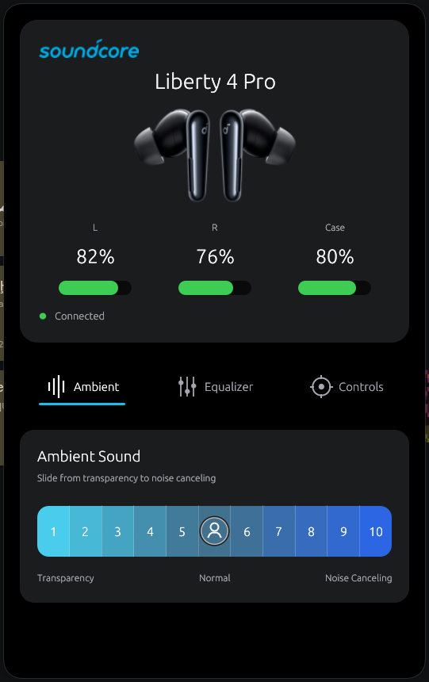
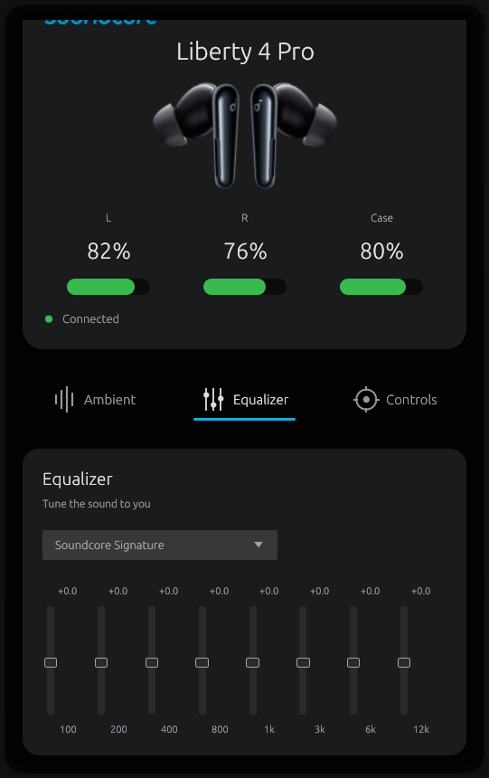
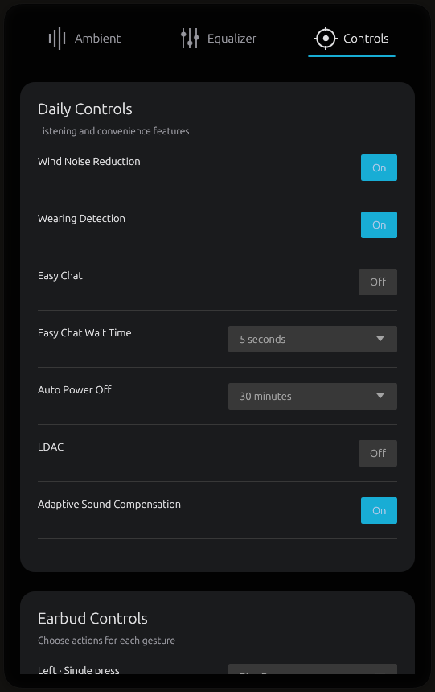

<p align="center">
  
</p>

<h1 align="center">Liberty Control</h1>

<p align="center">
  A native Linux desktop controller for Soundcore Liberty 4 Pro earbuds.
</p>

<p align="center">
  <a href="https://github.com/d7omdev/liberty-control/actions/workflows/ci.yml"></a>
  
  
  
</p>

<p align="center">
  
</p>

Liberty Control brings the most useful Soundcore mobile-app controls to a responsive desktop interface. It talks directly to paired earbuds through BlueZ and the pinned Liberty 4 Pro implementation in [OpenSCQ30](https://github.com/Oppzippy/OpenSCQ30).

> [!IMPORTANT]
> Liberty Control currently targets **Soundcore Liberty 4 Pro, model A3954**. Other Soundcore models are not supported.

## Features

- Live left, right, and case battery levels
- Continuous ambient control:
  - Levels **1–5** for transparency
  - A dedicated **Normal** mode in the center
  - Levels **6–10** for noise canceling
- Automatic recovery when the earbuds omit the active ambient strength during startup
- Soundcore equalizer presets and an eight-band custom equalizer
- Daily controls including wearing detection, Easy Chat, wind-noise reduction, auto power-off, LDAC, and adaptive sound compensation
- Configurable left/right press, long-press, and slide gestures
- Persistent system tray menu with battery information, ambient-mode selection, Bluetooth disconnect, reopen, and quit actions
- Responsive, scrollable interface usable down to a 420 px window width

## Screenshots

<table>
  <tr>
    <td align="center"><strong>Equalizer</strong></td>
    <td align="center"><strong>Daily and earbud controls</strong></td>
  </tr>
  <tr>
    <td></td>
    <td></td>
  </tr>
</table>

## Requirements

- Linux with BlueZ
- Liberty 4 Pro earbuds already paired and connected
- A desktop with Wayland or X11
- Rust **1.85 or newer** when building from source

Install the build and runtime dependencies on Arch Linux:

```bash
sudo pacman -S --needed \
  base-devel rustup pkgconf dbus bluez bluez-utils \
  libxkbcommon wayland mesa libx11 libxcursor libxi libxrandr
rustup default stable
```

Package names differ on other distributions.

## Install

Clone the repository and run the user-level installer:

```bash
git clone https://github.com/d7omdev/liberty-control.git
cd liberty-control
./install.sh
```

The installer builds an optimized release and installs:

| Item | Path |
| --- | --- |
| Binary | `~/.local/bin/liberty-control` |
| Desktop launcher | `~/.local/share/applications/liberty-control.desktop` |
| Application icon | `~/.local/share/icons/hicolor/512x512/apps/liberty-control.png` |

Open **Liberty Control** from the desktop launcher, or run:

```bash
~/.local/bin/liberty-control
```

## Run from source

```bash
cargo run --release
```

If more than one compatible device is visible, select one by MAC address:

```bash
LIBERTY_CONTROL_MAC=AA:BB:CC:DD:EE:FF cargo run --release
```

## System tray

While Liberty Control is running, its logo appears in desktops that support the StatusNotifierItem protocol. Click the icon to view battery information, change ambient mode, disconnect the earbuds, reopen the window, or quit the application.

Closing the main window hides it while the tray service and Bluetooth connection continue running. Use **Quit Liberty Control** in the tray menu to exit completely. Tray presentation depends on the desktop shell or status bar.

## Troubleshooting

### Earbuds are not found

1. Confirm the earbuds are awake and connected in your desktop Bluetooth settings.
2. Run `bluetoothctl info <MAC>` and check that it reports `Connected: yes`.
3. Reopen Liberty Control or press **Try again**.

### Tray icon is missing

Confirm that your desktop panel supports StatusNotifierItem/AppIndicator tray icons. Some minimal Wayland setups require enabling a tray module in the panel configuration.

### Ambient level is missing after connection

Liberty Control repairs the Liberty 4 Pro's occasionally missing active-mode strength during startup. If the device was connected after the app opened, press **Try again** to establish a fresh control session.

## Development

```bash
cargo fmt --all -- --check
cargo test --all-targets
cargo clippy --all-targets -- -D warnings
```

The app is split into focused modules:

- `src/device.rs` — BlueZ/OpenSCQ30 connection and command worker
- `src/domain.rs` — device-to-UI state mapping and command translation
- `src/tray.rs` — Linux StatusNotifierItem integration
- `src/main.rs` — responsive egui interface

Runtime state is stored in `${XDG_DATA_HOME:-~/.local/share}/liberty-control/devices.sqlite3`. Liberty Control has no telemetry and does not require an internet connection at runtime.

## Uninstall

```bash
rm -f ~/.local/bin/liberty-control
rm -f ~/.local/share/applications/liberty-control.desktop
rm -f ~/.local/share/icons/hicolor/512x512/apps/liberty-control.png
```

## Credits

Bluetooth protocol support is provided by [`openscq30-lib`](https://github.com/Oppzippy/OpenSCQ30), pinned to a revision with Liberty 4 Pro support.

Soundcore and Liberty are trademarks of their respective owners. Liberty Control is an unofficial community project and is not affiliated with or endorsed by Soundcore or Anker Innovations.

## License

Licensed under the [GNU General Public License v3.0 or later](LICENSE).
